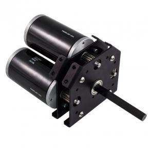

#Technical Documentation: Mechanical Design

## *Strategy*
As we came back from Kickoff, we immediately started to formulate the game strategy for this year’s competition. Right away, we ruled out being a hopper-dependant robot.  Early on in the match we figured the hoppers would either be purposefully activated to dump the balls, and there’d be a surplus of fuel on the game floor, regardless. So we created an Intake in order to pick up balls from the floor. We also made that intake vertical, transporting the balls in an elevator-like path into a ball reservoir We also knew we wanted to try and do gears for autonomous. That way, we could guarantee ourselves a significant amount of points during the autonomous period. We debated  about being a low goal shooter, but in the end we decided to go for the high goal on the boiler, because of the value discrepancy between each type of goal. We thought of it this way, we would have to put 3x as many balls into the low boiler boiler goal  for the same amount of points and 1 shot for the high boiler. With a little bit of fine tuning we could shoot for high goal and get more value for the same amount of time. In our design, one of the upperclassmen suggested having a ‘3-headed shooter’ that would not only go for high goal, but would shoot 3 balls at a time. This would make us highly efficient, and although we might not be as accurate, dishing out as many possible points as possible would lead for us to be desirable to other team’s strategies.
For gears, although we initially wanted a passive gear system, but soon turned into an active system of which two doors would push the gear out, onto its pin. We ended up designing the climber later, and created a spool to coil up the rope, which was relatively narrow in respect to the rest of the back of the robot. To fix this, we implemented another system above the climber to move the rope into the narrower mouth of the climber. In terms of our drive train, we finalized on a torque-heavy robot to be hard to defend and block against, especially in the final rounds.
  [TODO: reorder the information about rivnuts and manufacturing/sheet metal etc so it is in an order that makes sense]

## *Design Goals and Principles*
[TODO: fill out design goals/principles]

## *Drivetrain Design*
The drive train was built for versatility, robustness, and modularity. Design was heavily influenced by our manufacturing capabilities. Our primary manufacturing facility has tooling for sheet metal, so we designed most of the robot, including the drivetrain, in sheet metal. The decision was reinforced by the sheet metal design tools provided by Solidworks. We used 6061-T6 alloy 0.0625” sheets for a majority of parts.
### Drive Wheels
We chose to use 8” OD pneumatic wheels for our robot this year. The wheels allow us to regulate the speed and traction by setting the pressure of the wheels. 

[TODO: Insert tire presure image comparison]

We used these wheels for their high traction. This will provide a higher grip when being defended against. A six (6) wheel skid drive train is used; three (3) wheels on each side of the drivetrain. These wheels are belted together using HTD 15mm belts. Although belts are more prone to slipping, they are lighter than chain and gears. The weight of the wheels was a concern; all six (6) drive wheels weigh approximately 10.8 lbs. The wheels alone would be nine percent (9%) of the total robot weight, assuming a 120lb robot.

### Drive Power and Reduction

In the 2017 season, speed and agression is a must have for a drive train. The game is less about what can be accomplished and more about how efficient the task is accomplished. When designing the drive train, the motor power and reduction is one of the most important features of the drive train. The dirve power determines the speed of the robot, which is directly proportional to scoring rates, and how much your robot can push and avoid pushing. Pushing is most important in finals. When the motor is geared for torque over speed, the robot will be more consistant because it cannot be blocked as easily. This defense feature in tandom with high traction wheels make a robot that is harder to defend, which is a very good feature for the finals. In the beginning of the gearbox design, we were considering the possibility of the *"two and a half cim"* drive train, where each side of the skid drive is driven by two cims and a minicim. This would provide us an edge in the speed category. We were looking for a single-speed-single-reduction (SSSR) gearbox. The best fit for our needs was on the VEX Pro store.

The issue came when the highest reduction the gearbox supported was a 7:1. We did the math against the Tough-box mini's which we used in pervious years. If we were to use the 7:1 SSSR gearbox, we would loose seven pounds (7lbs) of pushing power, and only increase our speed by 30% in a perfect world. This was an unacceptable loss of torque. The SSSR would be havier and harder to do finely controlled programming for. Because of this, and the overall cost of ordering four (4) new gearboxes for both the robot, and the practice robot, we decided to go with the Tough Box Mini's. The mini's are a tride and true gearbox with built in encoders and we had enough in supply for both robots. 

## *Intake Design*
Early on in the game strategy process we decided we wanted to be a shooter robot.  Our source of fuel was to come from the floor, as the hoppers are expected to be depleted early in the match . The intake on the robot is located in the center between drive trains,  shifted back a little over a foot towards the back of the robot. That way, we also have a reservoir between drivetrains where we can pick up and store a significant amount of balls without having them in the fuel tank. The frame is made of TS 6061 Aluminum, it houses two shafts which are tethered together with surgical tubing bands.

[TODO: Insert picture of banebots intake wheel pattern CAD]

The shafts include a pattern of T40 2- 3/8” and 1-3/8” Banebots wheels which alternate: The smaller diameter wheels sits in between two larger ones to create a slot of which the surgical tubing to go in. There is also a  ‘C’ curved backplate in order to smoothly feed the fuel into our storage tank. We decided to use a 775 Pro motor, with a 10:1 gear ratio.
 
[TODO: Isometric view of Intake CAD]

### Fasteners

This year's fastener choice was heavily influenced by that of previous years with a few tweaks. We made the desicion to have less hardware diversity. This means that we are less likely to not have the correct size of something in case of breaking. For instance, last year, our climber was had a hook which was fastened to an arm with one 1" countersunk #10 made of special hardeded steel to be able to take the load. in competition, the load from the 120lb robot made the screw very dificult to repair when it came arround to routine arm maintenance. The screw was stripped due to someone useing a very small #2. When it came to needing a new screw, we didn't have any extra because of how specific the screw was, and no other teams around us has any. This made it very dificult to repair the arm while using a stripped screw. This year, we are using generic #10 screws almost exclusivly. This means that we can just bring a surplus of generic screws and we will never have any problems with specialized hardware breaking. Instead of ungodly ammounts of nylock nuts we used in previous years, we are increasing the frequency of rivnut on the robot. The use of rivnuts makes removing and attatching modules from the robot quicker because the nut doesn't need to be heald in place in order to unscew a fastener. One of the reasons that rivnuts were not used as frequently last year is due to their easy stip torque. In previous years, we used aluminum rivnuts, but by using a mix of aluminum and steel this year, we can have fasteners that support over tightened screwes.

# Manufacturing and Fabrication

*When Manufacturing, safety is our top priority. Propper PPE are training are of the upmost importance.*

## Sheet Metal Cuts

Our team manufactures most of the parts by hand. We use 1:1 drawings made by our design team in Solidworks. The manufacturing process beigns with the design team, they must develop a cutlist and drawing list with the correct number of parts that need to be manufactured. We then print out the 1:1 drawings, and cut the sheet metal to bounding rectangles of the size. 
