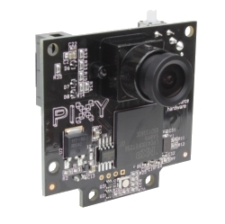
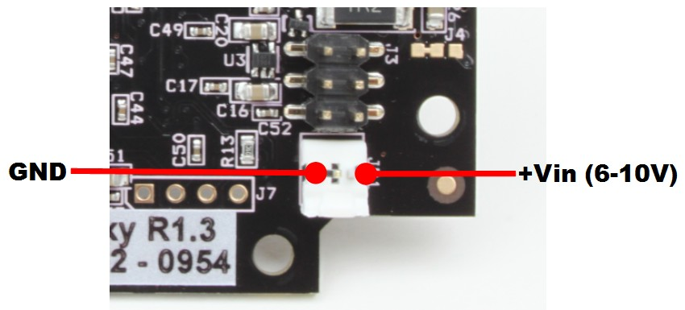

# Documentation: Vision

## *Meet the Pixy*
This year we are using the new [pixy camera from charmed labs](http://charmedlabs.com/default/pixy-cmucam5/ "Pixy (CMUcam5) | Charmed Labs") to complete the much needed, yet difficult, task of equipting our robot with vision capabilities to find what it's looking for. 

### *About the Pixy*
[TODO: fill out About the Pixy]

- *Basic* need to know info about it

### *Playing with the roboRIO*

[TODO: fill out Playing with the roboRIO]

### *Powering the Pixy*
[TODO: fill out Playing with the roboRIO]

